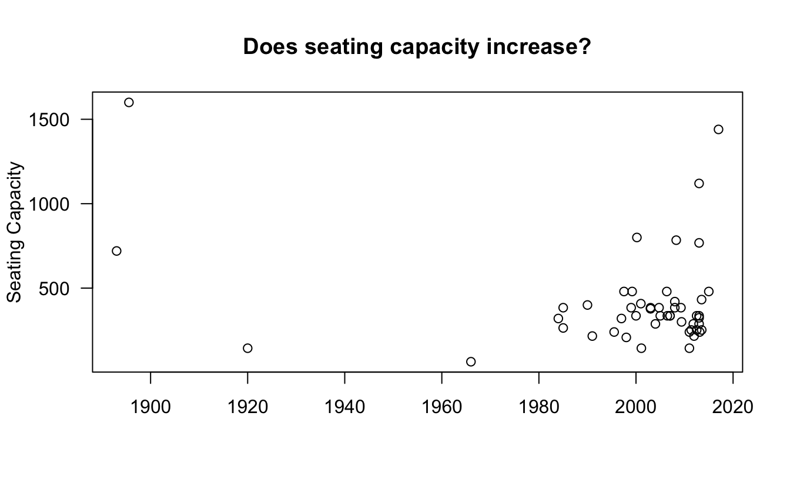
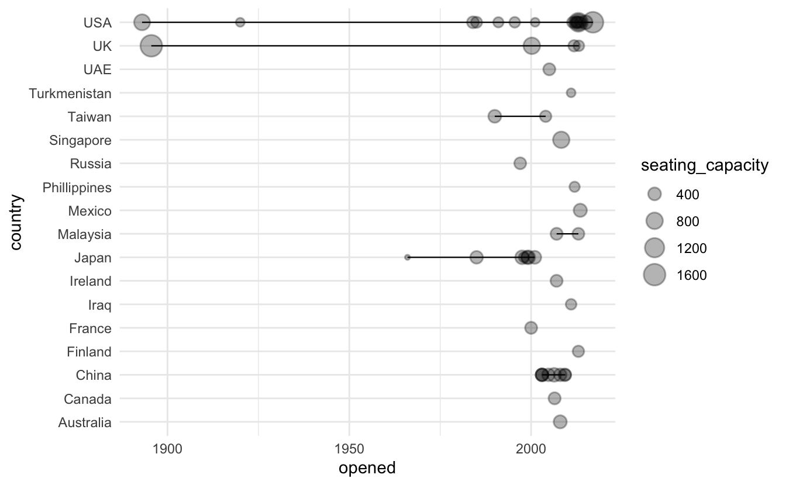
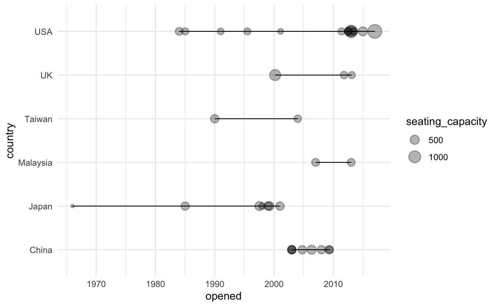
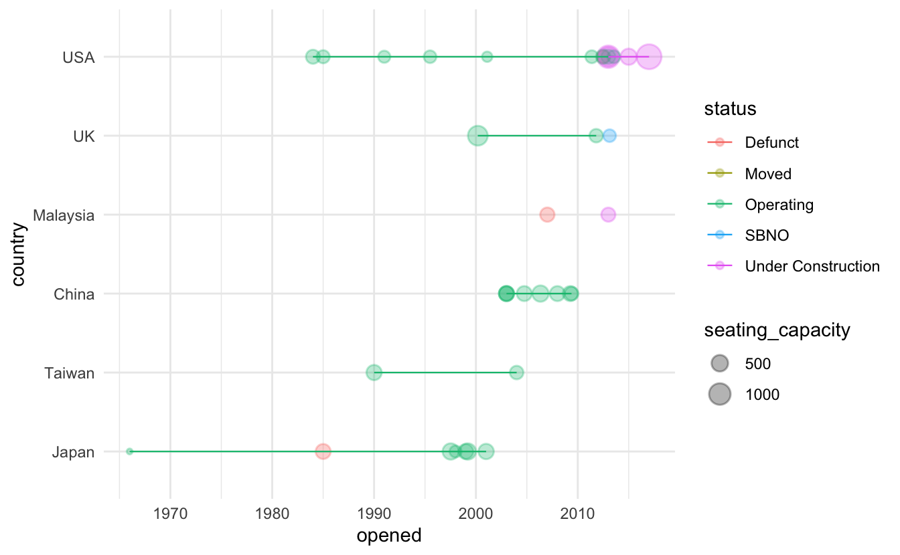
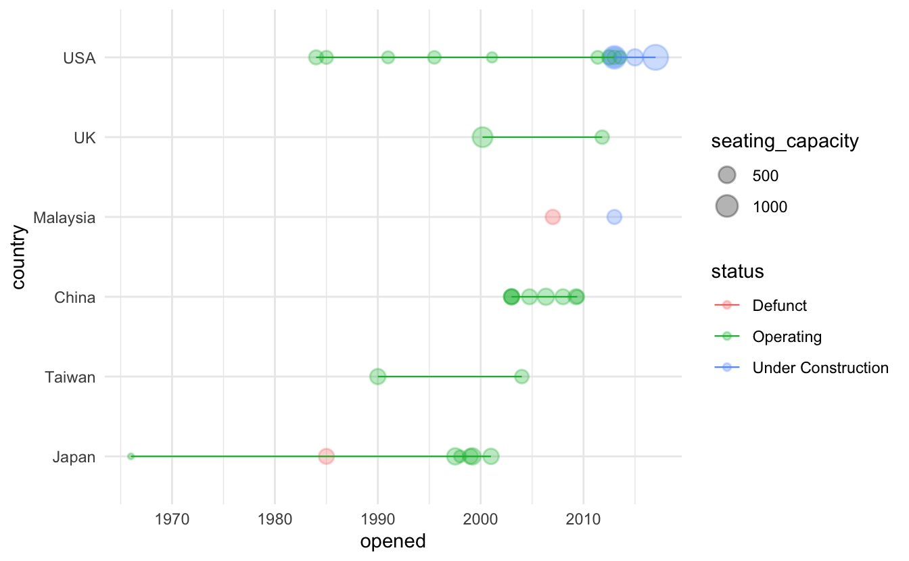
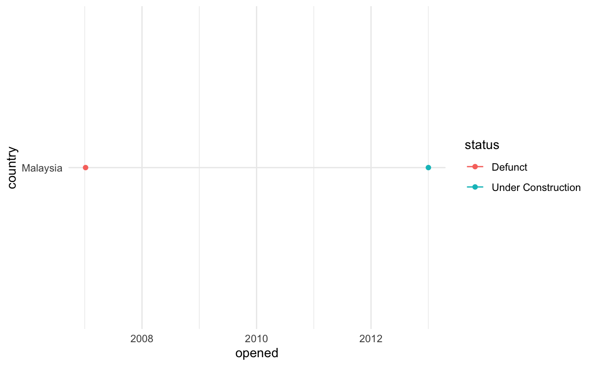
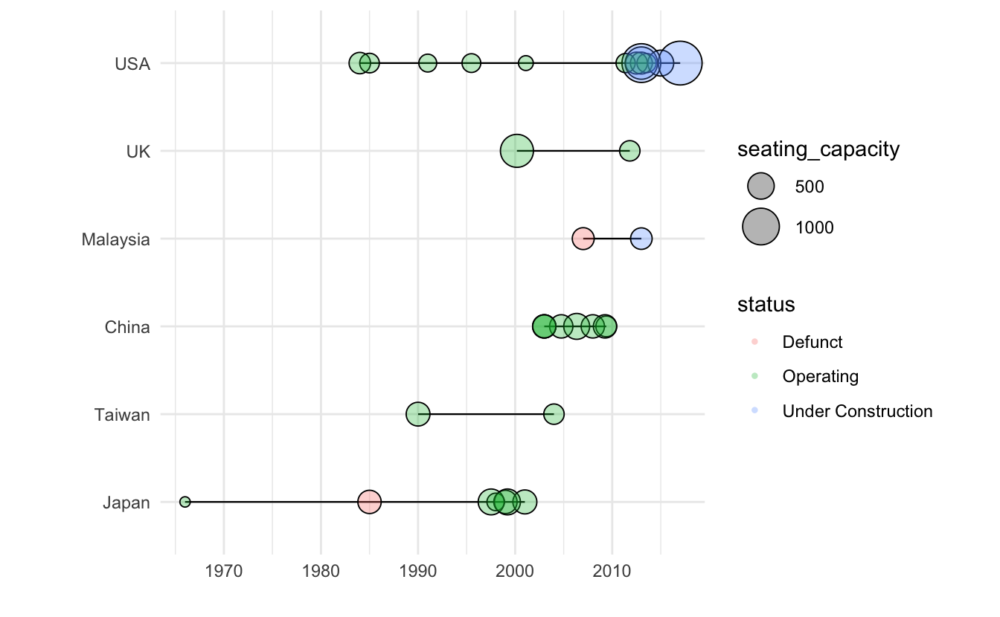

## Ferris Wheels

For this week, I want to ask did the development of ferris wheels in one country effect the development of ferris wheels in another country?

<pre class='chroma'><code class='language-r' data-lang='r'>wheels &lt;- <a href='https://rdrr.io/r/utils/read.table.html'>read.csv</a>("wheels.csv")
<a href='https://rdrr.io/r/utils/head.html'>head</a>(wheels)#&gt;   X                name height diameter     opened     closed country
#&gt; 1 1 360 Pensacola Beach 200.00       NA 2012-07-03 2013-01-01     USA
#&gt; 2 2              Amuran 303.00    199.8 2004-01-01       &lt;NA&gt;   Japan
#&gt; 3 3       Asiatique Sky 200.00    200.0 2012-12-15       &lt;NA&gt; Tailand
#&gt; 4 4        Aurora Wheel 295.00    272.0       &lt;NA&gt;       &lt;NA&gt;   Japan
#&gt; 5 5         Baghdad Eye 180.00       NA 2011-01-01       &lt;NA&gt;    Iraq
#&gt; 6 6 Beijing Great Wheel 692.64    642.7       &lt;NA&gt;       &lt;NA&gt;   China
#&gt;                          location number_of_cabins passengers_per_cabin
#&gt; 1        Pensacola Beach; Florida               42                    6
#&gt; 2               Kagoshima; Kyushu               36                   NA
#&gt; 3        Asiatique the Riverfront               42                   NA
#&gt; 4 Nagashima Spa Land; Mie; Honshu               NA                   NA
#&gt; 5         Al-Zawraa Park; Baghdad               40                    6
#&gt; 6          Chaoyang Park; Beijing               48                   40
#&gt;   seating_capacity hourly_capacity ride_duration_minutes climate_controlled
#&gt; 1              252            1260                  12.0                Yes
#&gt; 2               NA              NA                  14.5                Yes
#&gt; 3               NA              NA                    NA                Yes
#&gt; 4               NA              NA                    NA               &lt;NA&gt;
#&gt; 5              240             960                  15.0               &lt;NA&gt;
#&gt; 6             1920            5760                  20.0                yes
#&gt;   construction_cost    status         design_manufacturer          type
#&gt; 1           Unknown     Moved        Realty Masters of FL Transportable
#&gt; 2           Unknown Operating                        &lt;NA&gt;          &lt;NA&gt;
#&gt; 3           Unknown Operating       Dutch Wheels (Vekoma)          &lt;NA&gt;
#&gt; 4           Unknown Operating                        &lt;NA&gt;         Fixed
#&gt; 5    $6 million USD Operating                        &lt;NA&gt;          &lt;NA&gt;
#&gt; 6  $290 million USD   Delayed The Great Wheel Corporation         Fixed
#&gt;   vip_area ticket_cost_to_ride                  official_website turns
#&gt; 1      Yes                &lt;NA&gt;                              &lt;NA&gt;     4
#&gt; 2     &lt;NA&gt;                &lt;NA&gt;                              &lt;NA&gt;     1
#&gt; 3     &lt;NA&gt;                &lt;NA&gt;      http://www.asiatiquesky.com/    NA
#&gt; 4     &lt;NA&gt;                &lt;NA&gt; http://www.nagashima-onsen.co.jp/    NA
#&gt; 5     &lt;NA&gt;                 3.5                              &lt;NA&gt;    NA
#&gt; 6     &lt;NA&gt;                &lt;NA&gt;                              &lt;NA&gt;     1</code></pre>

## Data Selection and EDA

Here is the data I plan to use for the figure.

<pre class='chroma'><code class='language-r' data-lang='r'>figure_data &lt;- wheels <a href='https://magrittr.tidyverse.org/reference/pipe.html'>%&gt;%</a> 
  <a href='https://dplyr.tidyverse.org/reference/select.html'>select</a>(country, opened, name, seating_capacity, status) <a href='https://magrittr.tidyverse.org/reference/pipe.html'>%&gt;%</a> 
  <a href='https://tidyr.tidyverse.org/reference/drop_na.html'>drop_na</a>()
<a href='https://rdrr.io/r/utils/head.html'>head</a>(figure_data)#&gt;   country     opened                  name seating_capacity    status
#&gt; 1     USA 2012-07-03   360 Pensacola Beach              252     Moved
#&gt; 2    Iraq 2011-01-01           Baghdad Eye              240 Operating
#&gt; 3 Ireland 2007-01-01         Belfast Wheel              336   Defunct
#&gt; 4      UK 2011-10-24        Brighton Wheel              288 Operating
#&gt; 5   China 2004-10-01 Changsha Ferris Wheel              384 Operating
#&gt; 6     USA 1893-01-01         Chicago Wheel              720   Defunct</code></pre>

<pre class='chroma'><code class='language-r' data-lang='r'>figure_data$opened &lt;- <a href='https://rdrr.io/r/base/as.Date.html'>as.Date</a>(figure_data$opened)
figure_data$country &lt;- <a href='https://rdrr.io/r/base/factor.html'>as.factor</a>(figure_data$country)</code></pre>

As a sanity check, I expect the capactity to increase through time.

<pre class='chroma'><code class='language-r' data-lang='r'><a href='https://rdrr.io/r/graphics/plot.default.html'>plot</a>(x=figure_data$opened,
     y=figure_data$seating_capacity,
     main="Does seating capacity increase?",
     xlab="",
     ylab="Seating Capacity",
     las=1)</code></pre>

Interesting, I wonder what happened in the earlier years.

<pre class='chroma'><code class='language-r' data-lang='r'>figure_data <a href='https://magrittr.tidyverse.org/reference/pipe.html'>%&gt;%</a> 
  <a href='https://dplyr.tidyverse.org/reference/filter.html'>filter</a>(opened&lt;"1910-01-01") <a href='https://magrittr.tidyverse.org/reference/pipe.html'>%&gt;%</a> 
  <a href='https://dplyr.tidyverse.org/reference/filter.html'>filter</a>(seating_capacity&gt;750)#&gt;   country     opened        name seating_capacity  status
#&gt; 1      UK 1895-07-17 Great Wheel             1600 Defunct</code></pre>

The Great Wheel sounds wild---it was built in London after the sucess of the Chicago Ferris Wheel. No big horror stories it looks like though.

## Figure Construction

<pre class='chroma'><code class='language-r' data-lang='r'><a href='https://ggplot2.tidyverse.org/reference/ggplot.html'>ggplot</a>(<a href='https://ggplot2.tidyverse.org/reference/aes.html'>aes</a>(x=opened, y=country, size=seating_capacity), data=figure_data) +
  <a href='https://ggplot2.tidyverse.org/reference/geom_point.html'>geom_point</a>(alpha=.3, stroke=.8) +
  <a href='https://ggplot2.tidyverse.org/reference/geom_path.html'>geom_line</a>(size=.4)</code></pre>

Well, this won't do. I want to sort these by the length of the line. And there is way to much empty space. I will try filtering the data again to only focus on things past 1950. I am just going to select countries with more than one ferris wheel too.

<pre class='chroma'><code class='language-r' data-lang='r'><a href='https://rdrr.io/r/base/print.html'>print</a>(<a href='https://rdrr.io/r/base/unique.html'>unique</a>(figure_data$country))#&gt;  [1] USA          Iraq         Ireland      UK           China       
#&gt;  [6] Japan        Turkmenistan UAE          Malaysia     Finland     
#&gt; [11] Phillippines Taiwan       Russia       Canada       France      
#&gt; [16] Singapore    Mexico       Australia   
#&gt; 18 Levels: Australia Canada China Finland France Iraq Ireland ... USAcountry_filter &lt;- figure_data <a href='https://magrittr.tidyverse.org/reference/pipe.html'>%&gt;%</a> 
  <a href='https://dplyr.tidyverse.org/reference/count.html'>count</a>(country) <a href='https://magrittr.tidyverse.org/reference/pipe.html'>%&gt;%</a> 
  <a href='https://dplyr.tidyverse.org/reference/filter.html'>filter</a>(n!=1) <a href='https://magrittr.tidyverse.org/reference/pipe.html'>%&gt;%</a> 
  <a href='https://dplyr.tidyverse.org/reference/select.html'>select</a>(country)

country_filter &lt;- country_filter$country

figure_data &lt;- figure_data <a href='https://magrittr.tidyverse.org/reference/pipe.html'>%&gt;%</a> 
  <a href='https://dplyr.tidyverse.org/reference/filter.html'>filter</a>(opened&gt;"1955-01-01") <a href='https://magrittr.tidyverse.org/reference/pipe.html'>%&gt;%</a> 
  <a href='https://dplyr.tidyverse.org/reference/filter.html'>filter</a>(country <a href='https://rdrr.io/r/base/match.html'>%in%</a> country_filter)</code></pre>

Okay, try this again.

<pre class='chroma'><code class='language-r' data-lang='r'><a href='https://ggplot2.tidyverse.org/reference/ggplot.html'>ggplot</a>(<a href='https://ggplot2.tidyverse.org/reference/aes.html'>aes</a>(x=opened, y=country, size=seating_capacity), data=figure_data) +
  <a href='https://ggplot2.tidyverse.org/reference/geom_point.html'>geom_point</a>(alpha=.3, stroke=.8) +
  <a href='https://ggplot2.tidyverse.org/reference/geom_path.html'>geom_line</a>(size=.4)</code></pre>

Better maybe I will sort decending by the most recent ferris wheel.

<pre class='chroma'><code class='language-r' data-lang='r'>plot_order &lt;- figure_data <a href='https://magrittr.tidyverse.org/reference/pipe.html'>%&gt;%</a> 
  <a href='https://dplyr.tidyverse.org/reference/group_by.html'>group_by</a>(country) <a href='https://magrittr.tidyverse.org/reference/pipe.html'>%&gt;%</a> 
  <a href='https://dplyr.tidyverse.org/reference/top_n.html'>top_n</a>(1, opened) <a href='https://magrittr.tidyverse.org/reference/pipe.html'>%&gt;%</a> 
  <a href='https://dplyr.tidyverse.org/reference/arrange.html'>arrange</a>(opened)

plot_order &lt;- plot_order$country

figure_data$country &lt;- <a href='https://rdrr.io/r/base/factor.html'>factor</a>(figure_data$country, levels = plot_order)</code></pre>

<pre class='chroma'><code class='language-r' data-lang='r'><a href='https://ggplot2.tidyverse.org/reference/ggplot.html'>ggplot</a>(<a href='https://ggplot2.tidyverse.org/reference/aes.html'>aes</a>(x=opened, y=country, size=seating_capacity, color=status), data=figure_data) +
  <a href='https://ggplot2.tidyverse.org/reference/geom_point.html'>geom_point</a>(alpha=.3, stroke=.8) +
  <a href='https://ggplot2.tidyverse.org/reference/geom_path.html'>geom_line</a>(size=.4)</code></pre>

Okay, it seems crazy... does japan have one being built?

<pre class='chroma'><code class='language-r' data-lang='r'>wheels <a href='https://magrittr.tidyverse.org/reference/pipe.html'>%&gt;%</a> 
  <a href='https://dplyr.tidyverse.org/reference/filter.html'>filter</a>(country=="Japan") <a href='https://magrittr.tidyverse.org/reference/pipe.html'>%&gt;%</a> 
  <a href='https://dplyr.tidyverse.org/reference/arrange.html'>arrange</a>(opened)#&gt;     X                            name height diameter     opened closed country
#&gt; 1  49            Shining Flower Wheel 164.04   147.64 1966-01-01   &lt;NA&gt;   Japan
#&gt; 2  63                      Technostar 279.00   274.00 1985-01-01   &lt;NA&gt;   Japan
#&gt; 3  56                       Space Eye 328.00       NA 1990-01-01   &lt;NA&gt;   Japan
#&gt; 4  64           Tempozan Ferris Wheel 369.00   330.00 1997-07-12   &lt;NA&gt;   Japan
#&gt; 5  27                  HEP Five Wheel 347.77   246.06 1998-01-01   &lt;NA&gt;   Japan
#&gt; 6  14                    Daikanransha 377.00   328.00 1999-01-01   &lt;NA&gt;   Japan
#&gt; 7  13                  Cosmo Clock 21 369.00   328.00 1999-03-18   &lt;NA&gt;   Japan
#&gt; 8  15 Diamond and Flower Ferris Wheel 384.00   364.17 2001-01-01   &lt;NA&gt;   Japan
#&gt; 9  51               Sky Dream Fukuoka 394.00   361.00 2001-01-01   &lt;NA&gt;   Japan
#&gt; 10  2                          Amuran 303.00   199.80 2004-01-01   &lt;NA&gt;   Japan
#&gt; 11  8                           Big O 197.00   200.00 2006-01-01   &lt;NA&gt;   Japan
#&gt; 12 41                     Nippon Moon     NA       NA 2015-01-01   &lt;NA&gt;   Japan
#&gt; 13  4                    Aurora Wheel 295.00   272.00       &lt;NA&gt;   &lt;NA&gt;   Japan
#&gt;                            location number_of_cabins passengers_per_cabin
#&gt; 1                      Inagi; Tokyo               32                    2
#&gt; 2                  Tsukuba; Ibaraki               48                    8
#&gt; 3           Space World; Kitakyushu               NA                   NA
#&gt; 4                     Osaka; Honshu               60                    8
#&gt; 5  HEP Five building; Osaka; Honshu               52                    4
#&gt; 6              Palette Town; Odaiba               64                    6
#&gt; 7         Minato Mirai 21; Yokohama               60                    8
#&gt; 8          Kasai Rinkai Park; Tokyo               68                    6
#&gt; 9        Evergreen Marinoa; Fukuoka               NA                   NA
#&gt; 10                Kagoshima; Kyushu               36                   NA
#&gt; 11                  Tokyo Dome City               NA                   NA
#&gt; 12                             &lt;NA&gt;               32                   NA
#&gt; 13  Nagashima Spa Land; Mie; Honshu               NA                   NA
#&gt;    seating_capacity hourly_capacity ride_duration_minutes climate_controlled
#&gt; 1                64             349                  11.0               &lt;NA&gt;
#&gt; 2               384            1536                  15.0                Yes
#&gt; 3                NA              NA                    NA               &lt;NA&gt;
#&gt; 4               480            1920                  15.0               &lt;NA&gt;
#&gt; 5               208             832                  15.0                Yes
#&gt; 6               384            1440                  16.0               &lt;NA&gt;
#&gt; 7               480            1920                  15.0               &lt;NA&gt;
#&gt; 8               408            1440                  17.0                Yes
#&gt; 9                NA              NA                  20.0                Yes
#&gt; 10               NA              NA                  14.5                Yes
#&gt; 11               NA              NA                  15.0                Yes
#&gt; 12               NA              NA                  40.0                Yes
#&gt; 13               NA              NA                    NA               &lt;NA&gt;
#&gt;    construction_cost           status design_manufacturer       type vip_area
#&gt; 1            Unknown        Operating                &lt;NA&gt;       &lt;NA&gt;     &lt;NA&gt;
#&gt; 2            Unknown          Defunct                &lt;NA&gt;       &lt;NA&gt;     &lt;NA&gt;
#&gt; 3            Unknown        Operating                &lt;NA&gt;      Fixed     &lt;NA&gt;
#&gt; 4            Unknown        Operating                &lt;NA&gt;      Fixed     &lt;NA&gt;
#&gt; 5            Unknown        Operating                &lt;NA&gt;       &lt;NA&gt;     &lt;NA&gt;
#&gt; 6            Unknown        Operating                &lt;NA&gt;      Fixed     &lt;NA&gt;
#&gt; 7            Unknown        Operating                &lt;NA&gt;      Fixed     &lt;NA&gt;
#&gt; 8            Unknown        Operating               Senyo      Fixed     &lt;NA&gt;
#&gt; 9            Unknown        Relocated                &lt;NA&gt;      Fixed     &lt;NA&gt;
#&gt; 10           Unknown        Operating                &lt;NA&gt;       &lt;NA&gt;     &lt;NA&gt;
#&gt; 11           Unknown        Operating                &lt;NA&gt; Centerless     &lt;NA&gt;
#&gt; 12           Unknown Design/Financing            UNStudio      Fixed      Yes
#&gt; 13           Unknown        Operating                &lt;NA&gt;      Fixed     &lt;NA&gt;
#&gt;    ticket_cost_to_ride
#&gt; 1                 4.97
#&gt; 2                 &lt;NA&gt;
#&gt; 3                 &lt;NA&gt;
#&gt; 4                 6.97
#&gt; 5                 4.94
#&gt; 6                 8.87
#&gt; 7                 6.93
#&gt; 8                 6.93
#&gt; 9                 4.97
#&gt; 10                &lt;NA&gt;
#&gt; 11                7.87
#&gt; 12                &lt;NA&gt;
#&gt; 13                &lt;NA&gt;
#&gt;                                                            official_website
#&gt; 1                               http://www.fujiq.jp/attraction/shining.html
#&gt; 2                                                                      &lt;NA&gt;
#&gt; 3                                              http://www.spaceworld.co.jp/
#&gt; 4                                http://www.senyo.co.jp/tempozan/index.html
#&gt; 5                                                    http://www.hepfive.jp/
#&gt; 6                                              http://www.daikanransha.com/
#&gt; 7                          http://www.senyo.co.jp/cosmo/attraction/001.html
#&gt; 8                                             http://www.senyo.co.jp/kasai/
#&gt; 9  http://web.archive.org/web/20100126161452/http:/evergreenmarinoa.com/sd/
#&gt; 10                                                                     &lt;NA&gt;
#&gt; 11                               http://www.tokyo-dome.co.jp/e/attractions/
#&gt; 12   http://www.wired.co.uk/news/archive/2013-09/03/nippon-moon-giant-wheel
#&gt; 13                                        http://www.nagashima-onsen.co.jp/
#&gt;    turns
#&gt; 1     NA
#&gt; 2     NA
#&gt; 3     NA
#&gt; 4     NA
#&gt; 5     NA
#&gt; 6     NA
#&gt; 7     NA
#&gt; 8     NA
#&gt; 9     NA
#&gt; 10     1
#&gt; 11    NA
#&gt; 12    NA
#&gt; 13    NA</code></pre>

I want to clean up the status codes

<pre class='chroma'><code class='language-r' data-lang='r'>figure_data &lt;- figure_data <a href='https://magrittr.tidyverse.org/reference/pipe.html'>%&gt;%</a> 
  <a href='https://dplyr.tidyverse.org/reference/filter.html'>filter</a>(status <a href='https://rdrr.io/r/base/match.html'>%in%</a> <a href='https://rdrr.io/r/base/c.html'>c</a>("Defunct", "Operating", "Under Construction"))</code></pre>

<pre class='chroma'><code class='language-r' data-lang='r'><a href='https://ggplot2.tidyverse.org/reference/ggplot.html'>ggplot</a>(<a href='https://ggplot2.tidyverse.org/reference/aes.html'>aes</a>(x=opened, y=country, size=seating_capacity, color=status), data=figure_data) +
  <a href='https://ggplot2.tidyverse.org/reference/geom_point.html'>geom_point</a>(alpha=.3, stroke=.8) +
  <a href='https://ggplot2.tidyverse.org/reference/geom_path.html'>geom_line</a>(size=.4)</code></pre>

Okay, why doesn't Malaysia have a line?

<pre class='chroma'><code class='language-r' data-lang='r'>figure_data <a href='https://magrittr.tidyverse.org/reference/pipe.html'>%&gt;%</a> 
  <a href='https://dplyr.tidyverse.org/reference/filter.html'>filter</a>(country=="Malaysia") <a href='https://magrittr.tidyverse.org/reference/pipe.html'>%&gt;%</a> 
  <a href='https://ggplot2.tidyverse.org/reference/ggplot.html'>ggplot</a>(<a href='https://ggplot2.tidyverse.org/reference/aes.html'>aes</a>(x=opened, y=country, color=status)) +
      <a href='https://ggplot2.tidyverse.org/reference/geom_point.html'>geom_point</a>() +
      <a href='https://ggplot2.tidyverse.org/reference/geom_path.html'>geom_line</a>()#&gt; geom_path: Each group consists of only one observation. Do you need to adjust
#&gt; the group aesthetic?</code></pre>

Okay, it looks like I need to place the color in the point.

<pre class='chroma'><code class='language-r' data-lang='r'><a href='https://ggplot2.tidyverse.org/reference/ggplot.html'>ggplot</a>(<a href='https://ggplot2.tidyverse.org/reference/aes.html'>aes</a>(x=opened, y=country), data=figure_data) +
  <a href='https://ggplot2.tidyverse.org/reference/geom_path.html'>geom_line</a>(size=.4) +
  <a href='https://ggplot2.tidyverse.org/reference/geom_point.html'>geom_point</a>(alpha=1, stroke=.5, shape=21, color="black", <a href='https://ggplot2.tidyverse.org/reference/aes.html'>aes</a>(x=opened, y=country, size=seating_capacity), data=figure_data) +
  <a href='https://ggplot2.tidyverse.org/reference/geom_point.html'>geom_point</a>(alpha=.3, stroke=0, <a href='https://ggplot2.tidyverse.org/reference/aes.html'>aes</a>(color=status, x=opened, y=country, color=status, size=seating_capacity), data=figure_data) +
  <a href='https://ggplot2.tidyverse.org/reference/theme.html'>theme</a>(aspect.ratio=1) +
  <a href='https://ggplot2.tidyverse.org/reference/labs.html'>ylab</a>("") +
  <a href='https://ggplot2.tidyverse.org/reference/labs.html'>xlab</a>("") +
  <a href='https://ggplot2.tidyverse.org/reference/scale_size.html'>scale_size_area</a>(max_size=10)#&gt; Warning: Duplicated aesthetics after name standardisation: colour</code></pre>

<pre class='chroma'><code class='language-r' data-lang='r'>final_plot &lt;- <a href='https://ggplot2.tidyverse.org/reference/ggplot.html'>ggplot</a>(<a href='https://ggplot2.tidyverse.org/reference/aes.html'>aes</a>(x=opened, y=country), data=figure_data) +
  <a href='https://ggplot2.tidyverse.org/reference/geom_path.html'>geom_line</a>(size=.4) +
  <a href='https://ggplot2.tidyverse.org/reference/geom_jitter.html'>geom_jitter</a>(alpha=1, stroke=.4, height=.12, <a href='https://ggplot2.tidyverse.org/reference/aes.html'>aes</a>(color=status, x=opened, y=country, size=seating_capacity), data=figure_data) +
  <a href='https://ggplot2.tidyverse.org/reference/theme.html'>theme</a>(aspect.ratio=1) +
  <a href='https://ggplot2.tidyverse.org/reference/labs.html'>ylab</a>("") +
  <a href='https://ggplot2.tidyverse.org/reference/labs.html'>xlab</a>("") +
  <a href='https://ggplot2.tidyverse.org/reference/scale_size.html'>scale_size_area</a>(max_size=10)</code></pre>

<pre class='chroma'><code class='language-r' data-lang='r'># ggsave(file="final_plot.svg", plot=final_plot)</code></pre>

Awesome, there it is! I should include a label showing japan has 64 seats in the small \~1965 ferris wheel. And the \~2017 US one has a max of 1440.

What happened to Malaysia's recently defunct one?

